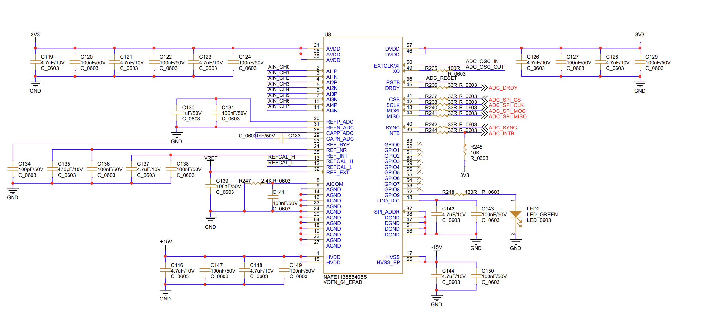
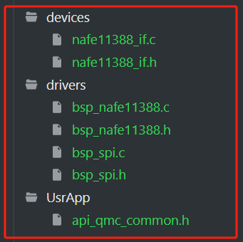

# nafe11388 ADC芯片驱动

- CPU平台：AT32F425

- 关键部分原理图：

  

- 驱动文件分层

> devices：提供给应用程序相关的接口
>
> drivers：平台spi的驱动层，ADC芯片的驱动层
>
> UsrApp：放置与应用相关的一些操作，如main.c，还有api_qmc_common.h这种公共类型管理



- 驱动版本V0.0.1

> （1）使用软件SPI CMD_xx方式进行采集触发，接口原型如下

```
/*!
 * @brief Triggers the sample gathering.
 *
 * @param[in, out] devHdl Handle for the device structure.
 * @param[in] xferHdl Handle for the transfer structure.
 *
 * @retval Returns status.
 */
static status_t NAFE_triggerSample(NAFE_devHdl_t *devHdl, NAFE_xferHdl_t *xferHdl);
```

> （2）接口均为同步接口，未封装SYNC，DRDY，INTB相关IO进行触发和查询转换状态；
>
> （3）支持ADC中的增益、通道映射等相关配置，支持5种采样模式
>
> - Single-channel single-reading (SCSR)
>
> - Single-channel continuous-reading (SCCR)
>
> - Multichannel single-reading (MCSR)
>
> - Multichannel multireading (MCMR)
>
> - Multichannel continuous reading (MCCR)